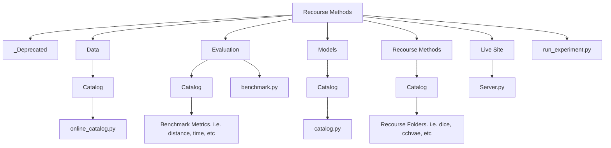

[](https://pypi.org/project/carla-recourse/) [](https://carla-counterfactual-and-recourse-library.readthedocs.io/en/latest/?badge=latest) 

# CHARM LAB RECOURSE LIBRARY


This repository is inspired and built on the CARLA library. CARLA is a python library to benchmark counterfactual explanation and recourse models. It comes out-of-the box with commonly used datasets and various machine learning models. Designed with extensibility in mind: Easily include your own counterfactual methods, new machine learning models or other datasets. Find extensive documentation [here](https://carla-counterfactual-and-recourse-library.readthedocs.io/en/latest/)! Our arXiv paper can be found [here](https://arxiv.org/pdf/2108.00783.pdf).

**What is algorithmic recourse?** As machine learning (ML) models are increasingly being deployed in high-stakes applications, there has been growing interest in providing recourse to individuals adversely impacted by model predictions (e.g., below we depict the canonical recourse example for an applicant whose loan has been denied). This library provides a starting point for researchers and practitioners alike, who wish to understand the inner workings of various counterfactual explanation and recourse methods and their underlying assumptions that went into the design of these methods.


### Notebooks / Examples

- Getting Started (notebook): [Source](https://carla-counterfactual-and-recourse-library.readthedocs.io/en/latest/notebooks/how_to_use_carla.html)
- Causal Recourse (notebook): [Source](https://carla-counterfactual-and-recourse-library.readthedocs.io/en/latest/notebooks/how_to_use_carla_causal.html)
- Plotting (notebook): [Source](https://carla-counterfactual-and-recourse-library.readthedocs.io/en/feature-plotting/notebooks/plotting_example.html)
- Benchmarking (notebook): [Source](https://carla-counterfactual-and-recourse-library.readthedocs.io/en/latest/notebooks/benchmark_example.html)
- Adding your own Data: [Source](https://carla-counterfactual-and-recourse-library.readthedocs.io/en/latest/examples.html#data)
- Adding your own ML-Model: [Source](https://carla-counterfactual-and-recourse-library.readthedocs.io/en/latest/examples.html#black-box-model)
- Adding your own Recourse Method: [Source 1](recourse_addition.md) [Source 2](https://carla-counterfactual-and-recourse-library.readthedocs.io/en/latest/examples.html#recourse-method)

### Available Datasets

| Name                         | Source                                                        |
| ---------------------------- | ------------------------------------------------------------- |
| Adult                        | [Source](https://archive.ics.uci.edu/ml/datasets/adult)       |
| COMPASS                      | [Source](https://www.kaggle.com/danofer/compass)              |
| Give Me Some Credit (Credit) | [Source](https://www.kaggle.com/c/GiveMeSomeCredit/data)      |
| German Credit                | [Source](https://www.kaggle.com/datasets/uciml/german-credit) |
| Mortgage                     |                                                               |
| TwoMoon                      |                                                               |

### Provided Machine Learning Models

| Model        |                                               Description                                               | Tensorflow | Pytorch | Sklearn | XGBoost |
| ------------ | :-----------------------------------------------------------------------------------------------------: | :--------: | :-----: | :-----: | :-----: |
| MLP (ANN)    | Multi-Layered Perceptron (Artificial Neural Network) with 2 hidden layers and ReLU activation function. |     X      |    X    |         |         |
| LR           |                      Linear Model with no hidden layer and no activation function.                      |     X      |    X    |         |         |
| RandomForest |                                          Tree Ensemble Model.                                           |            |         |    X    |    X    |

### Implemented Counterfactual methods

The framework a counterfactual method currently works with is dependent on its underlying implementation.
It is planned to make all recourse methods available for all ML frameworks . The latest state can be found here:

| Recourse Method                                            | Paper                                                                                                                        | Tensorflow | Pytorch | SKlearn | XGBoost |
| ---------------------------------------------------------- | :--------------------------------------------------------------------------------------------------------------------------- | :--------: | :-----: | :-----: | :-----: |
| CCHVAE                                                     | [Source](https://arxiv.org/pdf/1910.09398.pdf)                                                                               |            |    X    |         |         |
| Contrastive Explanations Method (CEM)                      | [Source](https://arxiv.org/pdf/1802.07623.pdf)                                                                               |     X      |         |         |         |
| Counterfactual Latent Uncertainty Explanations (CLUE)      | [Source](https://arxiv.org/pdf/2006.06848.pdf)                                                                               |            |    X    |         |         |
| CRUDS                                                      | [Source](https://finale.seas.harvard.edu/files/finale/files/cruds-_counterfactual_recourse_using_disentangled_subspaces.pdf) |            |    X    |         |         |
| Diverse Counterfactual Explanations (DiCE)                 | [Source](https://arxiv.org/pdf/1905.07697.pdf)                                                                               |     X      |    X    |         |         |
| Feasible and Actionable Counterfactual Explanations (FACE) | [Source](https://arxiv.org/pdf/1909.09369.pdf)                                                                               |     X      |    X    |         |         |
| FeatureTweak                                               | [Source](https://arxiv.org/pdf/1706.06691.pdf)                                                                               |            |         |    X    |    X    |
| FOCUS                                                      | [Source](https://arxiv.org/pdf/1911.12199.pdf)                                                                               |            |         |    X    |    X    |
| Growing Spheres (GS)                                       | [Source](https://arxiv.org/pdf/1712.08443.pdf)                                                                               |     X      |    X    |         |         |
| Mace                                                       | [Source](https://arxiv.org/pdf/1905.11190.pdf)                                                                               |            |         |    X    |         |
| Revise                                                     | [Source](https://arxiv.org/pdf/1907.09615.pdf)                                                                               |            |    X    |         |         |
| Wachter                                                    | [Source](https://arxiv.org/ftp/arxiv/papers/1711/1711.00399.pdf)                                                             |            |    X    |         |         |

## Installation/Setup

### Requirements

- `python3.7`
- `pip`

Using python directly or within activated virtual environment:

```sh
pip install -U pip setuptools wheel
pip install -r requirements-dev.txt
pip install -e .
```

## File Directory



### \_Deprecated Folder

This folder contains deprecated material from the [CARLA library](https://github.com/carla-recourse/CARLA) that is no longer considered useful for the current development efforts of this repository.

### Data Folder

This folder houses all datasets and their cached versions. It also contains the data catalog class, which includes methods for loading datasets and other relevant functionalities.

### Evaluation Folder

This folder contains the implementation of all evaluation and benchmark metrics used to compare recourse methods in the repository. This includes metrics such as `distance`, `redundancy`, `success rate`, `time`, `violations`, and `y nearest neighbors`.

### Live Site Folder

This folder contains the implementation of the frontend UI interface, which displays results stored in `results.csv` from executing `./run_experiment.py`.

### Models Folder

This folder contains all implemented models/classifiers in the repository. It also contains the model catalog class, which includes methods for loading models/classifiers and other relevant functionalities.

### Recourse Methods

This folder contains all the implemented recourse methods in the repository. Each recourse method has its own subfolder within the catalog directory (`recourse_methods/catalog`) and is implemented using the `RecourseMethod` API class` interface.

## Quickstart

```python
from data.catalog import DataCatalog
from evaluation import Benchmark
import evaluation.catalog as evaluation_catalog
from models.catalog import ModelCatalog
from random import seed
from recourse_methods import GrowingSpheres

RANDOM_SEED = 54321
seed(RANDOM_SEED) # set the random seed so that the random permutations can be reproduced again

# load a catalog dataset
data_name = "adult"
dataset = DataCatalog(data_name, "mlp", 0.8)

# load artificial neural network from catalog
model = ModelCatalog(dataset, "mlp", "tensorflow")

# get factuals from the data to generate counterfactual examples
factuals = (dataset._df_train).sample(n=10, random_state=RANDOM_SEED)

# load a recourse model and pass black box model
gs = GrowingSpheres(model)

# generate counterfactual examples
counterfactuals = gs.get_counterfactuals(factuals)

# Generate Benchmark for recourse method, model and data
benchmark = Benchmark(model, gs, factuals)
evaluation_measures = [
      evaluation_catalog.YNN(benchmark.mlmodel, {"y": 5, "cf_label": 1}),
      evaluation_catalog.Distance(benchmark.mlmodel),
      evaluation_catalog.SuccessRate(),
      evaluation_catalog.Redundancy(benchmark.mlmodel, {"cf_label": 1}),
      evaluation_catalog.ConstraintViolation(benchmark.mlmodel),
      evaluation_catalog.AvgTime({"time": benchmark.timer}),
]
df_benchmark = benchmark.run_benchmark(evaluation_measures)
print(df_benchmark)
```

Using python directly or within activated virtual environment:

```sh
python .\quickStart.py
```

### Loading Site

This interface displays the results from running the recourse benchmark library with a range of datasets, models and recourse methods.

```sh
cd .\live_site
pip install -r .\requirements.txt
python .\server.py
```

Read more from [here](livesite_amend.md) to learn about amending the live site tool.

## Testing

Using python directly or within activated virtual environment:

```sh
pip install -r requirements-dev.txt
python -m pytest .\sanity_test.py
```

## Running Experiment

Before running the command below, clear out all former computations from the `results.csv` file. Ensure to maintain the header (first line) of the csv file, and only delete the computation result.

```sh
python .\run_experiment.py
```

## Linting and Styling

- Python linting with [flake8](https://flake8.pycqa.org/en/latest/).
- Python styling with [black](https://github.com/psf/black).

```sh
black .\
```

## Contributing

Contributions of any kind are very much welcome! Take a look at the To-Do issues section to see what we are currently working on. If you have an idea for a new feature or a bug you want to fix, please follow look at the subsections below for our branching and commit policies, and make a PR with your suggestions.

### Branching

- Branch off of `main` for all feature work and bug fixes, and create a "feature branch". Prefix the feature branch name with your name. The branch name should be in snake case and it should be short and descriptive. E.g. `abu/readme_update`

### Commits

- Commits should be atomic (guideline: the commit is self-contained; a reviewer could make sense of it even if they viewed the commit diff in isolation)

- Commit messages and PR names are descriptive and written in **imperative tense**. With commit messages, they should include if they are a feature or a fix. E.g. "feat: create user REST endpoints", or "fix: remove typo in readme". From the example in the previous sentence, pay attention to the imperative tense used.

- PRs can contain multiple commits, they do not need to be squashed together before merging as long as each commit is atomic.

### Naming Conventions

- **Modules and Packages:** Use lowercase letters with underscores to separate words.
  Example: minimum_observables.py, growing_spheres.py.

- **Classes:** Use CamelCase for class names.
  Example: MinimumObservables, GrowingSpheres.

- **Functions and Methods:** Use lowercase with underscores to separate words.
  Example: load_data(), get_counterfactuals().

- **Variables:** Use lowercase with underscores. Be descriptive but concise.
  Example: training_data, learning_rate.

- **Constants:** Use uppercase letters with underscores to separate words.
  Example: MAX_EPOCHS, DEFAULT_BATCH_SIZE.

- **Global Variables:** Use a prefix like g* or global* to indicate that it is a global variable.
  Example: g_model_dir, global_logger.

### Implementation Suggestion

- We advise future contributors to consider utilizing `PyTorch` for their recourse implementations whenever possible. This recommendation stems from our past experience, which has demonstrated that `PyTorch` benefits from a larger community support and offers easier refactoring, in contrast to `TensorFlow`, which tends to be more susceptible to version changes.

### Reproducibility

- It is essential that implemented algorithms closely match the research paper they are derived from. Therefore, every implemented algorithm must be accompanied by a `reproduce.py` test file (in the corresponding folder in `recourse_methods/catalog`). This file should contain unit tests that replicate the experiments presented in the corresponding research paper, ensuring that the results obtained are consistent with those reported in the paper, within an acceptable margin of error.

## To-Do Issues

1. Expand the existing repository of available recourse methods to include new recourse methods.
   - Minimum Observables - https://arxiv.org/abs/1907.04135
   - ClaPROAR - https://arxiv.org/abs/2308.08187
   - PROBE - https://arxiv.org/abs/2203.06768
2. Extend the existing frontend design to incorporate new interactive features (Adjourned).
3. Revamp the entire library to a newer python version.
4. Refactor existing methods to utilize a singular backend type.
5. Extending the repo to be installible through pip.
